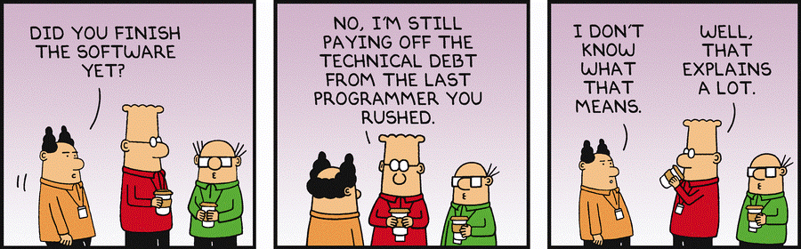

# Agile Methodology

The main idea behind the Agile Methodology is to solve problems by sprints 
and to frequently deliver partial results to the project stakeholders. This 
is opposed to trying to solve the whole problem and deliver the entire 
solution in one go.

Solving the problem by sprints helps the team to stay focused rather than 
getting overwhelmed. For the scientists, it’s also more satisfying because 
of the sense of completion. Clients are also happy to see the progress, of 
course!

Delivering results soon, starting with a minimum viable product (MVP), let 
the team collect feedback early in the development process and correct the 
course if necessary. It also promotes collaboration between scientists and 
stakeholders, which often leads to the discovery of new potential projects.

## Agile in practice

Here is an example of the Agile mindset in practice. Once the team has a 
good understanding of the business problem and its requirements, a typical 
next step is to design the input and output data schemas. It may also be a 
good time to define some of the user parameters. 

At that point, we should be able to deploy an app. It would not be a 
functional app, of course, because the underlying engine must still 
be developed. Nevertheless, the client can get a good feeling of what the 
final solution will look like.  If the client has any concerns, this is the 
best time to address them. If the client is happy with what they see, 
development can continue with confidence because we know that the 
expectations are in the right place. 

Next, as data becomes available, even before development kicks off, it may 
be appropriate to perform some exploratory analysis to see what the data 
reveals about the system. Any relevant information obtained with this 
exercise can be reported to the client, they will be happy to learn more 
about their own business and will feel that they are being part of the process.

## MVP and versioning

An important thing to emphasize is that MVP and partial deliveries do not 
mean minimum viable quality or partial solution quality. In fact, MVP and 
partial delivery must follow all best practices and target the same quality 
expected for the final solution.

Another important observation is that the Agile Methodology goes hand-in-hand 
with solution versioning. In most cases, one delivery will be an 
enhancement of the previous delivery. Being able to identify each version of 
the solution delivered is crucial for tracking issues, documentation, and 
releases, just to name a few.

## Starting with a baby version of the problem

So far, we have only discussed Agile Methodology from a development perspective. 
Turns out that the same mindset can be incredibly useful in other stages of 
a decision-making process. 

Suppose, for instance, you are assigned the task of solving a very 
challenging problem that you know very little about. The best approach, in this 
case, is to start by studying a baby version of the problem, the MVP. 
Hopefully, you will be able to solve the baby version, which will probably not 
give you the answer for the full version. But the solution for the baby 
version, or better yet, the reasoning that led to the solution of the baby 
version, you will certainly be able to draw some conclusions about the 
solution to the full problem. Such conclusions will likely help you solve 
larger versions of the problem and eventually generalize to the final answer. 

To see the power of this approach in practice, consider solving the 
[Digits Tracking Puzzle][digits_tracking_puzzle] with 100 digits. 
You will likely feel completely lost to start with. But then try solving a 
baby version with only four digits, then five, and then six. After that, you 
might well be able to generalize your solution to any number of digits.

Another practical example is debugging a code. If the bug seems too hard to 
find, try reproducing it with a very small instance of the data. This will 
allow you to more easily track how the code changes the data and eventually 
identify an odd behavior that leads to the bug. 

## User-Centered Design
User-Centered Design (UCD) is a methodology that sits very well with the 
Agile Methodology. The focus here is on how end-users interact with the 
solution, for example, a web app. So combining Agile and UCD means 
developing the solution while already empathizing with the experience of 
the end-user.

The key is to recognize that the end-users typically already have a mental 
model of their problem space. We show empathy to them by attempting to 
minimize disruption to that mental model as much as possible.

Consider, for instance, carefully thinking about the nomenclature and 
organization of the app. Specifically, discussing with the client how to 
name tables, columns, parameters, and actions, is not a lot of extra work 
but may drastically enhance the user experience. Table and parameters 
grouping/categorization and business log (messages reported during 
the execution of an engine) can also make a big difference.

## Technical Debt
Technical debt is a well-known term in computer science but not so known in 
other communities.

It takes place when developers find themselves spending significant energy 
and time doing additional rework because of bad decisions made previously, 
usually at the time the first version of the code was written. Specifically,
such bad decisions are made by choosing an easy/limited approach that gives 
benefit in the short-term (for example, quick to implement) but might 
accumulate “interest” over time.

Among the factors that lead to technical debt are tight deadlines, lack of 
documentation or lack of understanding of the problem requirements, and 
unawareness of technical debt itself.

Like risk, technical debt is not something that can be avoided but rather 
managed. Just being aware of technical debt is a good starting point to 
strike the right balance.

*Source: https://amgrade.com/technical-debt-what-can-it-mean-for-startup/*

[digits_tracking_puzzle]: https://www.mipwise.com/puzzles/digits-tracking

------------------------------------------------------------------------------
Click **Next** when you be ready to continue.

### [Home][home] | [Back][back] | [Next][next] | [Help][help]

[home]: ../../README.md
[back]: ../2_analytics/README.md
[next]: ../4_self_assessment/README.md
[help]: ../../0_help/README.md