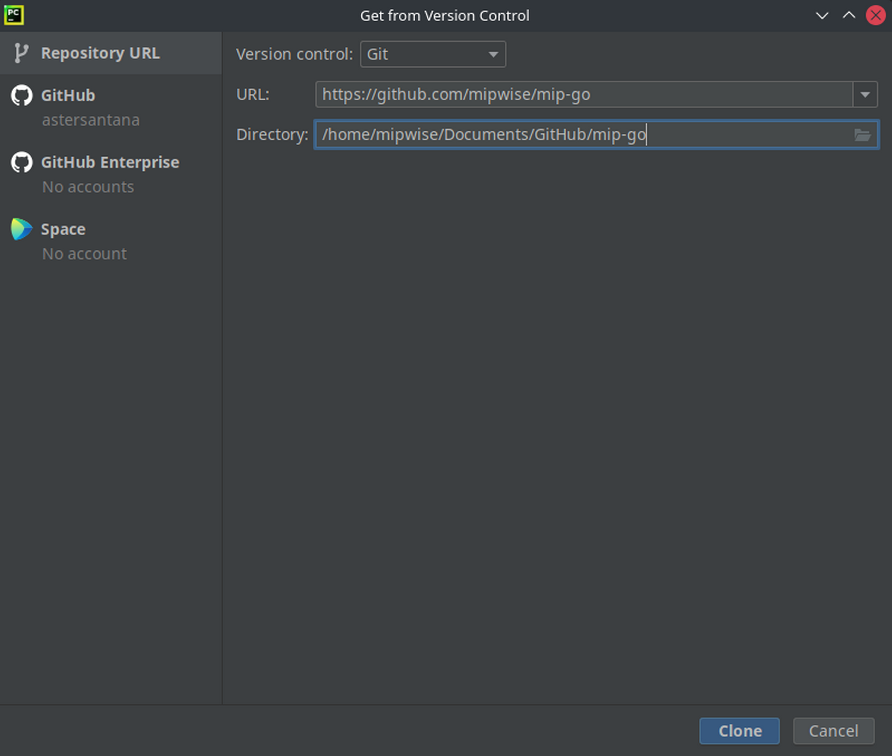

# Setting Up Mip Go in Pycharm

Now that you have installed Pycharm on your computer, it's time to take Mip 
Go there too.

Mip Go is going to be a project in your Pycharm environment just like any 
other project that you will create or collaborate with in the future. 

In fact, you are about to become a collaborator of the Mip Go program! 
Collaborator in the sense that you will be able to make changes to the 
source code (i.e., the Mip Go content) and share them with us. But no worries, 
there is no chance that you will mess up with the content on our end 
because you will be working on your own version of Mip Go (if you are 
familiar with GitHub, you know what we're talking about).

## Cloning the Mip Go repository
Cloning a repository means that you will download a copy of the repository 
to your local machine and, most importantly, you can keep the version of the 
cloud and your local version synchronized.

So, first, launch Pycharm and click on **Get from VCS** (or **Git > Clone...
** if you are already inside a project). In the dialog, enter the URL of 
the Mip Go repository, https://github.com/mipwise/mip-go, and select a 
folder where you will keep the local copy of the repository. To keep it 
standard, we recommend creating a directory called `GitHub` inside your 
`Documents` directory to host the project.

Once you are done, click **Clone**. If it asks you if you want to create a 
project from the cloned repository, select **Yes**. Then Pycharm will take 
care of the rest. 

Not able to clone? Check ou the [Error while cloning a repository]
[error-cloning-a-repository].

You should now be able to see all the modules and sections of the Mip Go 
program under **Project** on the left.

## Resuming the training from Pycharm
Go to **mip-go > 1_introduction > 7_setting_up_mip_go** 
and open the `README.md` file located in there.

You will realize that each one of these sections is a `README.md` file
located in a dedicated directory. When you open any of these files, you 
should see two side-by-side views: a raw view on the left, and a compiled view on the right. 
If you don't see two views, hover the cursor over the window to see three little 
icons in the top-right corner and select the **Editor and Preview** option.

📝 **Tip:**  
*To go back to the previously visited section/file in Pycharm, just hit `Ctrl+Tab`.*

[error-cloning-a-repository]: ../../0_help/README.md#Error-while-cloning-a-repository

------------------------------------------------------------------------------
Click **Next** (this time in Pycharm) to continue.

### [Home][home] | [Back][back] | [Next][next] | [Help][help]

[home]: ../../README.md
[back]: ../6_setting_up_pycharm/README.md
[next]: ../8_commit_push_pull/README.md
[help]: ../../0_help/README.md