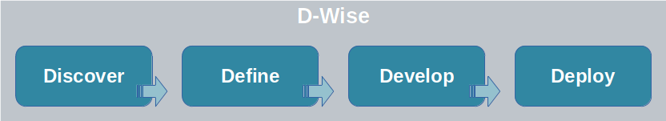

# Markdown

Markdown is a formatting syntax that uses only plain text which then can be 
converted to beautiful HTML documents. The formatting is surprisingly 
simple (easy to write and read) and yet there is so much we can do with it. 

Here is a shortlist of what can be done: 
- Basic formatting such as _italic_ and **boldface**
- Create sections and subsections
- Emoji 🙃
- Bullet lists
- Tables
- Insert links and figures
- Code blocks.

Markdown became so popular that it’s now standard and is compiled automatically
in many places. For instance, we can use Markdown on GitHub, Jupyter Notebooks 
(where it can even be combined with LaTeX to type math expressions), 
and README files like we did here to make 
the whole content of the Mip Go program available to you!

🤔 **Curiosity:** *Did you know that all README files in here have a `.md`
extension to indicate that we are using Markdown?!* 

Below is a list of examples of things we can do with Markdown.

## Sections ##

---------------------------------------------------------
# Section Level 1
Success is a feeling, there is no finishing line -- *Simon Sinek*.

## Section Level 2
It's our decisions, not the conditions of our lives, that determine our destiny -- *Tony Robbins*

### Section Level 3
Vision without execution is hallucination -- *Thomas Edison*

---------------------------------------------------------


## Emphasis ##
Whether you think **you can** or you think **you can't**, you are **right** -- *Henry Ford*

~~I would like to become a respectful decision scientist.~~  
I will become a respectful decision scientist.


## Emoji ##
Just copy emojis from a website such as [Emojipedia](https://emojipedia.org/)
and paste them here 😉.


## Links ##

### Motivations
Have you ever heard about the [Celery Test](https://www.youtube.com/watch?v=k_8gZnpKuLI)? 
If not, follow the link to watch a 4-minutes video and get inspired about 
making important decisions--or committing to the decisions you have already 
made.

### Resources
The www.markdownguide.org website is a great resource for learning Markdown.
They have lots of examples, recommendations for best practices, and even 
cheat sheets.

You can learn a lot more about Markdown by visiting the webpage of the 
[Markdown Project](https://daringfireball.net/projects/markdown/) itself.

### Mip Go
Don't know how to find Mip Go on the web?  
Follow [this link][mip_go] to see it on the Mip Wise website.  
Or follow [this link][mip_way_github] for its repository on GitHub .

[mip_way_github]: https://github.com/mipwise/mip_way
[mip_go]: https://mipwise.com/mip_way


## Images ##




## Lists ##
To make an impact:
1. Decide what you want
3. Take action
4. Notice what's working or not
5. Change your approach until it works

However, it takes:
* Clarity
* Determination
* Focus
* Resilience

Want to make an impact with analytics? Then you should know that there are 
three types of analytics:
- **Descriptive** 

    Understanding how the system has behaved historically

- **Predictive**

    Anticipating how the system will behave in the future

- **Prescriptive:** 

    Recommending actions to improve the future behavior of the system

And remember the grocery list from the Celery Test:
- [ ] m&m's
- [ ] Kit Kat
- [X] Rice Milk
- [X] Celery


## Code ##
Let `f` be a function that takes three arguments, `a`, `b`, and `c`, and returns their sum:

    def f(a, b, c):
        return a + b + c

If `+` was a regular addition operator, then, `f(1, 2, 3)` would return `6`,
of course. But depending on how you define `+`, here is what you can get:

    purpose = f(skills, interests, passion)

You can use a dictionary to save the input arguments, so you don't forget 
what they are:
```
input = {
    a: skills,
    b: interests,
    c: passion}
```

## Tables ##

| **Argument** | **Value** |
|:------------:|-----------|
|      a       | skills    |
|      b       | interests |
|      c       | passion   |

---------------------------------------------------------

📝 **Tip:** 
*If you find some interesting Markdown tricks that are not included above, 
add them yourself and make a commit! Remember, once you've made your editions,
all you need to do is to click on the green checkmark, write a commit message 
like below, and hit **Commit**.*
```text
markdown: Added a subsection showing how to create tables in Markdown 
```

------------------------------------------------------------------------------
In the next section, you will see how to use Jupyter Notebooks.
 
### [Home][home] | [Back][back] | [Next][next] | [Help][help]

[home]: ../README.md
[back]: ../README.md
[next]: ../2_jupyter_notebook/README.md
[help]: ../../0_help/README.md