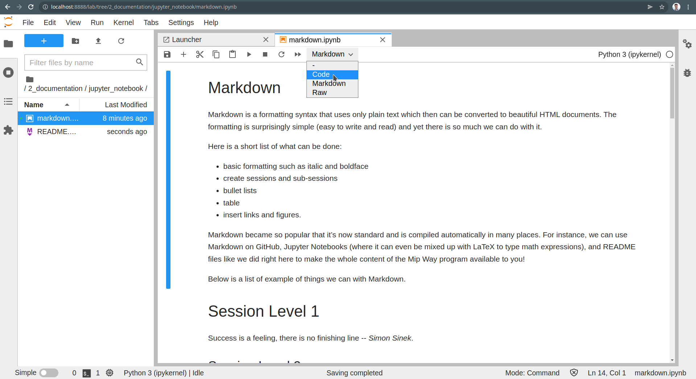

# Jupyter Notebook

Jupyter Notebook, which is part of the [Jupyter Project](https://jupyter.org/), 
is a web application that has become very popular, especially among data 
scientists, for performing tasks such as data cleaning and exploration, 
prototyping, demonstration, and documentation.

Perhaps the main convenience of using Jupyter Notebook is that it allows us 
to write and execute code (in various programming languages), visualize outputs, 
and write documentation, all that in the same document.

Even if you have been using Markdown for some time, you may have not realized 
how useful it can be for documentation. One feature that we find particularly
useful is that we can write pretty math expressions by just knowing the basics
of LaTeX (we will cover it in the next section).

## Installation
A convenient way to use Jupyter Notebooks is to use JupyterLab, which is a 
Python package just like Pandas and Numpy. You can install JupyterLab
right from here, in Pycharm!

To do so, click on the `Terminal` tab at the bottom of this window type in 
`pip install jupyterlab` and hit enter. 

Alternatively, you can go to the `Python Packages` tab. In the search box, type 
`jupyterlab` and select it from the list. Then just click `Install` in the 
top-right corner.

## Usage
Once installed, just type `jupyter-lab` in the terminal and hit enter to 
launch JupyterLab. It will open in your browser.

To open your first Jupyter Notebook, go to `/2_documentation/jupyter_notebook/`
and open `markdown.ipynb`. Then you will see the *markdown* section 
you covered previously beautifully compiled. 

* To edit an existing cell, just double-click on it.  
* To compile/run a cell, hit `CTRL + ENTER` or click on the run bottom on 
  the top.  
* To run some Python code, first create a new cell (plus bottom on the top),
  then select `Code` as in the figure above.

📝 **Tip:**  
*To create a beautiful PDF of your Jupyter Notebook document that you can 
share with
anyone, you can go to `File > Export Notebook As` or `File > Print...` and 
then `Save as PDF`.*

------------------------------------------------------------------------------
That's it for now!  
In the next section, you will learn some basics of LaTeX.

### [Home][home] | [Back][back] | [Next][next] | [Help][help]

[home]: ../../README.md
[back]: ../1_markdown/README.md
[next]: ../3_latex/README.md
[help]: ../../0_help/README.md