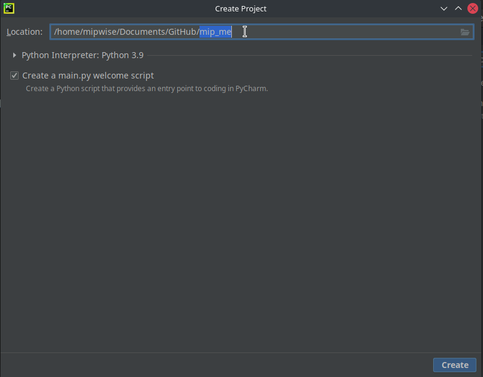
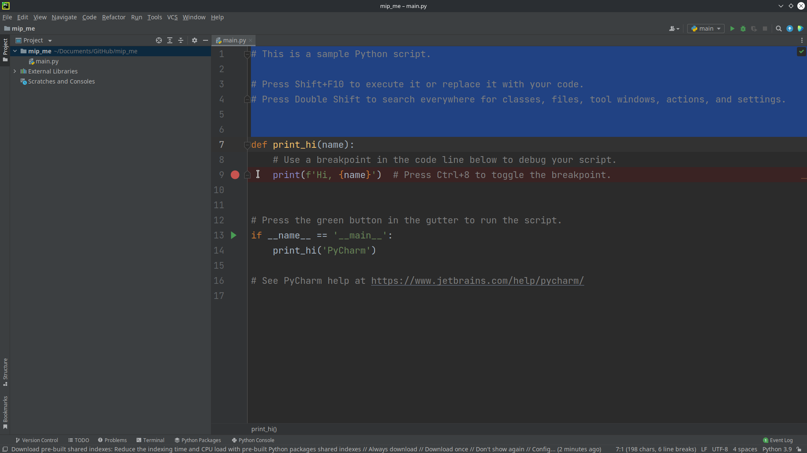
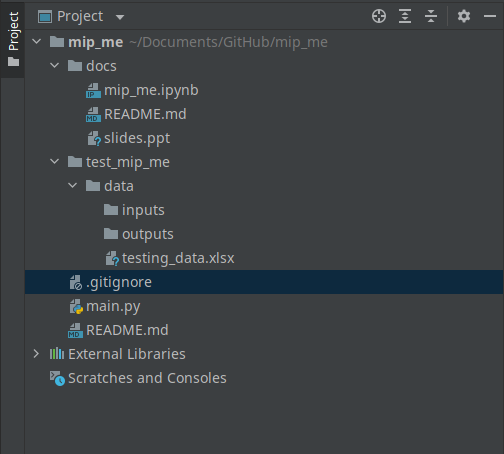
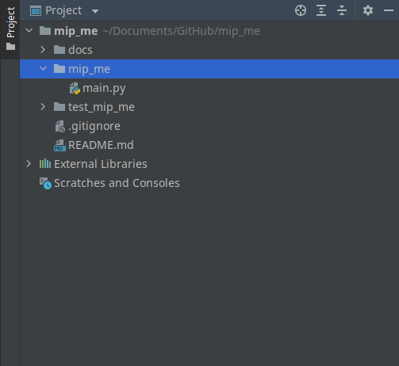

# New Project
Finally, it's time to take your very first step towards the implementation 
of your new project! Especially if this is your first time creating a 
project from scratch, you should be very excited about it!

So here is what you need to do:  
Go to **File > New Project** and enter a name for your project.
We named our project `mip_me`, as in "It's *me* starting to build 
*more intelligence power*". Once you are done, click **Create**.

Pycharm will automatically create a `main.py` file with some examples of 
what you can start doing right away.

You can go ahead and execute the file to see the output in the **Run** tab 
at the bottom.

📝 **Tip:** 
*There are multiples ways you can execute a file in Pycharm:*
- *Hit the green triangle at the right-top corner*  
- *Right-click on the name of the file on the left*
- *Right-click anywhere on the file itself (editor)*
- *Hit the green triangle next to `if __name__ == '__main__':`*

## Python Console
In any project, you can quickly write and execute Python scripts in the 
Python Console (tab at the bottom of your screen). To test it out, type in 
`import this` and hit enter to see [The Zen of Python][the_zen_of_python].

## Adding a README file
The first thing we recommend when you start a new project is to add a 
`README` file to it. Whether it's a collaborator, a client, a recruiter, or 
just a friend, the content of your `README` is the very first thing they 
will look for when they visit the repository of your project. And if the 
project is on GitHub, the content of the `README` is displayed in HTML,
like when you visit the [Mip Go][mip_go] repository.

To create a `README` file, right-click on the name of your project, i.e.,
at the root of your project directory, and then go to **New > File**.
Then name it `README.md`. 

❔️ **Curiosity**  
*The `md` extension of `README` files is so that GitHub and Pycharm, for 
instance, can recognize it as a Markdown file and compile it accordingly.*

Next, put into practice all that you have learned from the [Markdown]
[markdown] section and add some cool content to your newly created file.
Include in your `README` anything you think that might help people 
(including yourself in the future) to understand and use whatever you have 
built or are going to build. 

## Creating a `docs` subdirectory
To keep files organized, it's a good idea to create subdirectories within 
your repository. A very common one is the `docs` folder, which helps keep 
documentation separated from scripts.

To do that, right-click on the name of your project, i.e., at the root of 
your project directory, and then **New > Directory**.

📝 **Tip:** 
*You can add a `README.md` to every single directory and subdirectory of 
your repository. Each of them will get displayed on GitHub as you open the 
respective directory.*

## Adding a `.gitignore`
If you are not familiar with version control yet, this might not make much 
sense to you. But it's a good practice to add a `.gitignore` right away to a 
new repository. It's a file that tells GitHub to not track certain files 
that are irrelevant to whoever is going to collaborate with or use your
project. A good example is the local files created automatically by Pycharm 
and saved to a folder named `.idea` inside your project.

We typically don't create a `.gitignore` file from scratch. Instead, we 
start with a generic file for the type of project and edit it later if 
needed. For example, for this project, we are using a [.gitignore][gitignore]
that is generic for Python projects. So you can simply copy it from here and 
paste it to the root of your repository.

## Adding a subdirectory for testing
If you are building a solution, you will need data to test it. Just like 
documents, you don't want to mix data files, such as `.cvs` and `.xlsx`, 
with script files. Therefore, it's also a good practice to create a 
dedicated subdirectory. This is also the place where we will keep the unit 
testing code later on.

There is a naming convention for this type of directory, which is `test_` 
followed by the repository name. In our case, it becomes `test_mip_me`.

So go ahead and create a testing subdirectory for your project even if you 
don't have data yet.

## Adding a license
Depending on what your project is about, you may also want to add a license. 
Technically it's just a text file named `LICENSE`. But not having a license 
can have big consequences on your project. So we encourage you to have a 
look at the [choosealicense][choosealicense] website to learn more.

## Adding a directory for scripts
At this point, our directory looks like this:

In this example, `main.py` is the only script file that we have. As you 
might guess, any real-world project will likely have multiple script files. 
So it's a good idea to create a subdirectory for them as well. For reasons 
that will become clearer later, we recommend naming this subdirectory with 
the same name of your repository itself, `mip_me` in our case.

So in the end, we have this: 

You may not realize it, but this is already a big step
towards being [OSy](../2_best_practices/README.md)! 
In fact, we are being organized by creating subdirectories and distributing 
the files in a way that makes sense. We are also being systematic by 
following standards and conventions.

Perhaps, we can even claim that we are building a tidy solution, although 
we haven't written any code yet.

## Do I really need all this?
You might be wondering: are all these steps above really necessary for my 
projects? Perhaps they are not necessary for your current project. 
But the point is that **you are better off setting your standards to what 
you want to achieve and what you want to be**, not for what you currently 
have nor what you currently are.

Sometimes, it might even feel like you are pretending to be a software 
developer. It might sound like *"fake it until you make it"*. But that's OK.
After all, even The Beatles started their career as a cover band.

------------------------------------------------------------------------------
Next, you will start implementing the schema of your application. And, as a 
bonus, you will be getting your solution protected against dirty data!

[mip_go]: https://github.com/mipwise/mip_go
[markdown]: ../../2_documentation/1_markdown/README.md
[gitignore]: ../../.gitignore
[choosealicense]: https://choosealicense.com/
[the_zen_of_python]: https://www.python.org/dev/peps/pep-0020/

### [Home][home] | [Back][back] | [Next][next] | [Help][help]

[home]: ../../README.md
[back]: ../2_best_practices/README.md
[next]: ../4_data_schema/README.md
[help]: ../../0_help/README.md