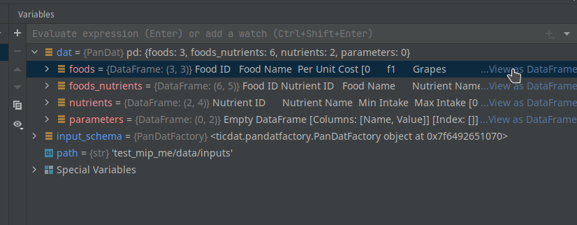
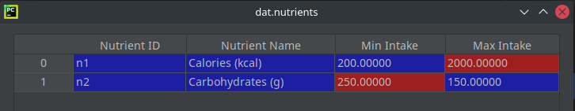
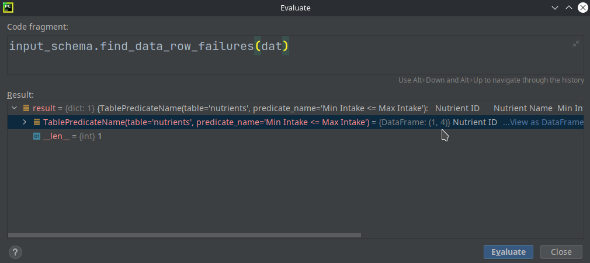
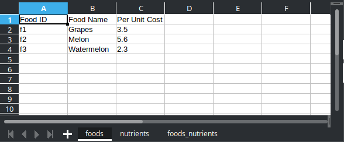

# Loading Data
To test the implementation of our data schema, we need to load data into 
memory and feed it into the schema.

There are many ways we can load data in Python. One classic way is to use 
Pandas, but we will be using ticdat because it will automatically feed the 
data into our defined data schema.

Using ticdat, we can load data from Excel, CSV, SQL, JSON, and Postgres 
databases. We will illustrate using Excel and CSV files.

## Loading data from a collection of CSV files
When reading data from CSV files, it's expected that each table defined in 
the schema is stored as a separated CSV file whose name matches the name of 
the corresponding table. In addition, the columns' names must match the 
fields' names defined in the schema.

If you already have your data inside the `data/inputs` directory of your 
package's testing directory, then go back to the `execute_locally.py` file 
and replace its content with the following:
```python
from mip_me import input_schema
path = "data/inputs"
dat = input_schema.csv.create_pan_dat(path)
print(dat)
```
Of course, if you are testing with your own project, you must replace 
`mip_me` with your project's name in the first two lines. Also, notice that 
we're sticking with the repository structure introduced in the [New Project]
[new_project] section.

If the path, tables' names, and fields' names are all correct, you will be 
able to execute the `execute_locally.py` file successfully.

You can also place a breakpoint next to the printing statement and execute 
it in debug mode. Then, in the **Variables** window, expand `dat` and click 
on *View as DataFrame* next to a table to visualize its data.



📝 **Tip:** 
*As the name suggests, the method `create_pan_dat` creates a PanDat object, 
which is nothing but a collection of Pandas DataFrames. We associate to 
this object the variable `dat` (the abbreviation for "data") because it 
comes from the input schema. When it comes from the output schema, we use 
the variable `sln`, the abbreviation for "solution".*

## Evaluating expressions
Pycharm has a functionality called *Evaluate Expression* that is super 
helpful for debugging. Let's illustrate how to use it in this example.

As we know, there is a problem with the data of our 'nutrients' table. **Min 
Intake** is larger than **Max Intake** for Carbohydrates.



To see on the fly how ticdat would capture this data row failure, execute 
the `execute_locally.py` script in the debug mode, and once it reaches the 
breakpoint next to the printing statement, right-click anywhere in the 
editor and select **Evaluate Expression**. In the pop-up window, type in 
`input_schema.find_data_row_failures(dat)` and click in **Evaluate** (or 
hit `CTRL+ENTER`).


In the result, you will see that ticdat found a row predicate issue in the 
table `nutrients`, in row 1 and column 4. On Mip Hub, data integrity
failures like this will be reported as nicely formatted tables.



In addition to `find_data_row_failures`, you can try 
`find_duplicates`, `find_data_type_failures`, and 
`find_foreign_key_failures`.

## Loading data from an Excel file
When reading data from XLS files, it's expected that each table defined in 
the schema is stored as separate sheets of the same worksheet. Again, the names 
of tables and fields must match those defined in the schema.



You can use the same script above to load data from XLS (or XLSX) files. 
You only have to replace `csv` with `xls` in the third line and change the 
``path`` variable to include the name of the worksheet, along with the 
respective extension, `.xls` or `.xlsx`. For example:
```python
from mip_me import input_schema
path = "data/inputs/my_worksheet.xlsx"
dat = input_schema.xls.create_pan_dat(path)
print(dat)
```

------------------------------------------------------------------------------
Next, you will start to implement solve engines!

[new_project]: ../3_new_project/README.md

### [Home][home] | [Back][back] | [Next][next] | [Help][help]

[home]: ../../README.md
[back]: ../5_python_package/README.md
[next]: ../7_solve_engines/README.md
[help]: ../../0_help/README.md