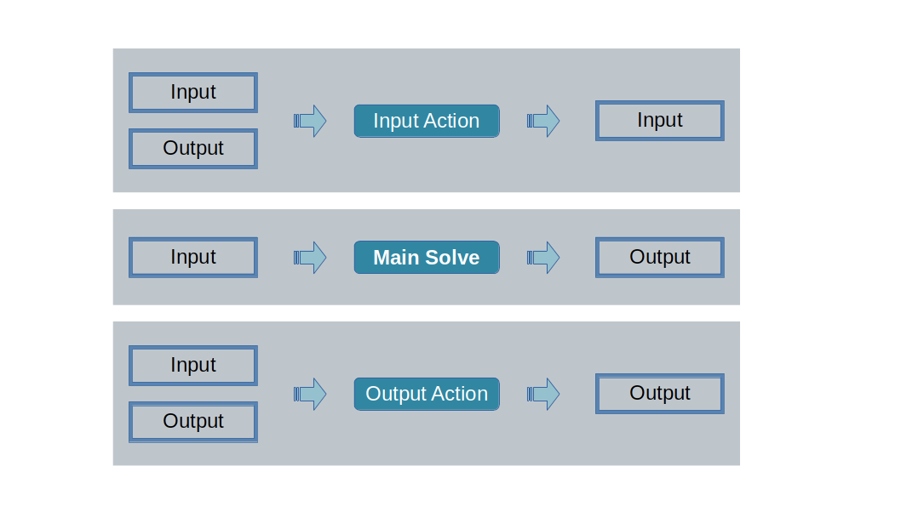

# Solve Engines
We call *engine* (sometimes also called *solve engine* or 
*solve code*) a Python function that takes as input a data 
object and returns another data object, or a transformed version of 
the input data object. In some cases, the engine can receive two
data objects as inputs, one from the input schema and one from
the output schema.

To be clear, data objects here are `PanDat` objects as we saw in the 
[Loading Data](../6_loading_data/README.md) section.

There are two main types of solve engines: 
* **main engine**  
  This is the function that hosts or calls the core engine of the solution. 
  For example, in the case of the diet problem, the core engine solves an 
  optimization problem that recommends the amount of each food to buy. One 
  key characteristic of the main engine is that it typically takes as an input 
  a data object of the input schema, i.e., a `dat` object, and returns a 
  data object of the output schema, i.e., a `sln` object. In other words, 
  main engines read from the input and write to the output.
* **action engines**  
  Action engines are functions that perform auxiliary tasks. It may be a 
  data preparation step or a report-building task, for example. Actions 
  that act on the input schema are called *input actions* and actions that 
  act on the output schema are called *output actions*. Input actions can 
  only write to the input schema, i.e., they must return a `dat` object,
  and output actions can only write to the output schema, i.e., they must 
  return a `sln` object. But both types of actions can read from inputs and 
  outputs, i.e., they both can take a `dat` and `sln` object simultaneously.

------------------------------------------------------------------------------
We will start with the implementation of an input action in the next section.

### [Home][home] | [Back][back] | [Next][next] | [Help][help]

[home]: ../../README.md
[back]: ../6_loading_data/README.md
[next]: ../8_input_actions/README.md
[help]: ../../0_help/README.md