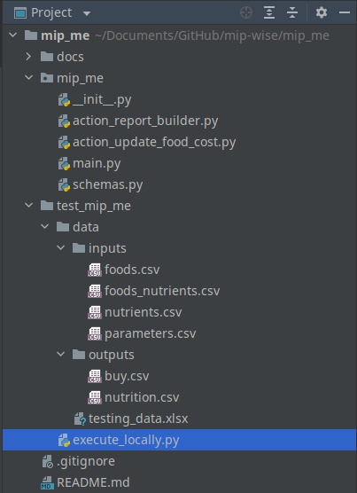

# Next Steps
Congratulations! You just completed the most intensive module of D-Wise!
This was a big accomplishment and a very significant step towards becoming
a decision scientist!

At this point, you should have an MVP of your solution (like we have for the 
diet problem), and the structure of your package should look like this:

Notice that the solution itself is composed of the content of the script 
directory only. In our example, it contains only four modules plus 
`__init__.py`.

We hope that this structure doesn't intimidate you too much anymore. But if 
you are still feeling intimidated, it may comfort you to know that you are 
very close to deploying your first app on Mip Hub and bringing your MVP to life!

Also, you might be feeling like there are too many rules to follow, such as 
naming conventions and specific directory structures. In this case, there 
are a few points for you to keep in mind:
* Most of the practices that we cover in this program come from 
  writing normal Python, and they are not mandatory. 
* If you don't follow the suggested protocol, it will make it hard for us
  to help you, and even harder for you to collaborate with others. 
* Think of driving: if everyone follows the traffic regulations, everyone 
  can safely go everywhere (perhaps not as quickly as they would if they 
  were to ignore red lights and speed limits, but would you do that?).
* Unless you are a professional developer already (in which case you
  would not be taking this program), following our standards will lead
  you to write way better code than you would do otherwise.

📖 **Reading:**
*If you find yourself doubting your capabilities of being a professional
programmer, check out the blog post:
[Deprogramming Limiting Beliefs][deprogramming_limiting_beliefs].* 

[deprogramming_limiting_beliefs]: https://www.mipwise.com/blogs/deprogramming-limiting-beliefs

------------------------------------------------------------------------------

The next module is *Deploy*. There, we will configure the package to 
finally deploy it as an app on Mip Hub.

⭐⭐⭐⭐⭐ If you think the content of the Mip Go program could benefit others, 
please visit the page https://github.com/mipwise/mip-go and click on the 
Star button in the top-right corner of the page.

### [Home][home] | [Back][back] | [Help][help]

[home]: ../../README.md
[back]: ../12_output_action/README.md
[help]: ../../0_help/README.md