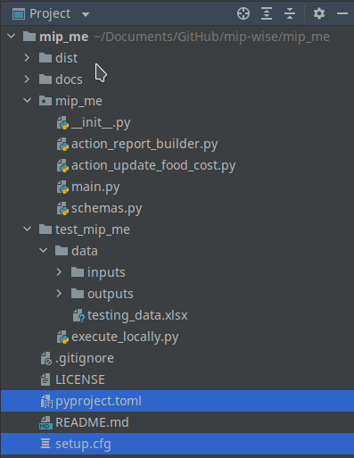

# Distribution Package

Now that we have a complete version of our solution already structured as a 
proper Python package, it's time to get it ready for distribution.

Distribution can be in the form of a *source distribution package* (*sdist* 
for short) or deployment. A sdist is what we typically use to install a 
package, using `pip install`, for instance. It's also a sdist that we 
upload to Mip Hub to deploy apps.

So, how do we create a sdist for our package?

We simply execute a command, from the terminal of the project, that looks 
like this:
```commandline
python3 -m build
```

But hold on a second! We are not ready to execute this command yet.  
First, we have to perform two steps:
1. Install two packages: [setuptools][setuptools]
and [build][build]
2. Add two configuration files to the project: `pyproject.toml` and `setup.cfg`

After that, the package will look like this:



## Installing [setuptools][setuptools] and [build][build]
We will be using these packages to generate the distribution archives. 
Though these packages are not the only options (see for instance
[flit][flit], [hatch][hatch], and [poetry][poetry]), we chose 
[setuptools][setuptools] and [build][build] because they are used in the 
[Packaging Projects][packaging_projects] tutorial.

So, go to the terminal or your project and ensure you have the latest 
version of `pip`, `setuptools`, and `build`. You can do all three with a 
single command like this:
```commandline
python3 -m pip install --upgrade pip setuptools build
```
🗒️ **Note:** 
*If your operating system is Windows, use `python` only instead of
`python3`*

## Creating configuration files
To generate distribution files of a package, you need to specify some 
configurations for your project.

### Creating a `pyproject.toml` file
This file will tell `pip` what's required to build the distribution files of 
your project. 

So, go to the root directory of your package, create a text file named 
`pyproject.toml`, and add the following content to it:

```toml
[build-system]
requires = [
    "setuptools>=42",
    "wheel"
]
build-backend = "setuptools.build_meta"
```
You can find more details about `pyproject.toml` in the 
[Creating pyproject.toml][creating-pyproject-toml]
section of the [Packaging Projects][packaging_projects] tutorial.

### Creating a `setup.cfg` file 
This file will provide `setuptools` with lots of important details about 
your package.

So, go to the root directory of your package, create a text file named 
`setup.cfg`, and add the following content to it:
```ini
[metadata]
name = mip_me
version = attr: mip_me.__version__
author = Aster Santana
author_email = aster.santana@mipwise.com
description = Illustration package that uses the diet problem
long_description = file: README.md
long_description_content_type = text/markdown
url = https://github.com/mipwise/mip_me
project_urls =
    Bug Tracker = https://github.com/mipwise/mip_me/issues
classifiers =
    Programming Language :: Python :: 3
    License :: OSI Approved :: MIT License
    Operating System :: OS Independent

[options]
packages = mip_me
install_requires =
    ticdat>=0.2.21
    pandas>=0.18.1
    gurobipy==9.5.0
python_requires = >=3.6
```
Of course, you will need to update this information according to your 
project, especially the name of the package (which appears in a few different 
places) and the dependencies, i.e., the packages that are required in your 
project. 

Minimal dependencies can be listed under `install_requires`. You can visit 
[Dependencies Management in Setuptools][dependency_management]
to find more details about dependency management.

You can also find more details about `setup.cfg` files in the 
[Configuring Metadata][configuring_metadata] section of the
[Packaging Projects][packaging_projects] tutorial.

## Generating distribution archives
We are ready! Now, you can execute the following command from the terminal 
of your project:
```commandline
python3 -m build
```
Again, if your operating system is Windows, use `python` only instead of
`python3`.

You should see a lot of text in the log and, in the end, something
like this:
```text
Successfully built mip_me-0.1.0.tar.gz and mip_me-0.1.0-py3-none-any.whl
```
Then, you will see that a directory called `dist` (for distribution)
has been created inside your project. It will contain two distribution files: 
* `tar.gz`: This is the source distribution package, sdist, that we have 
  been talking about. This is nothing but a compressed archive containing
  all the files required to build and install your package.
* `.whl`: This is called a *wheel* file, which is a compiled version 
  of the sdist file and is ready for installation. 

📝 **Tip:** 
*A package can be installed from either file using `pip`, but wheel
files are generally preferred because installation is always faster 
(since the building part has already been done).*

## Next steps
A common thing to do at this point is to upload the package to
the Python Package Index (PyPI) so that anyone with access to the
internet can install your package by executing something like this:
```commandline
pip install name_of_your_package
```
We are not going down this route right now. But if you want to do
so, you can find instructions in the 
[Uploading The Distribution Archives][uploading_to_pypi] section
of the [Packaging Projects][packaging_projects] tutorial.

Instead, we will help you to test your package in two ways:
1. By uploading your project to Mip Hub and deploying an app.
2. By installing your package in another project using a virtual 
  environment.

------------------------------------------------------------------------------
In the next section, you will learn more about Mip Hub, the Mip Wise's 
platform for app deployment.

[build]: https://packaging.python.org/en/latest/key_projects/#build
[setuptools]: https://packaging.python.org/en/latest/key_projects/#setuptools
[flit]: https://packaging.python.org/en/latest/key_projects/#flit
[poetry]: https://packaging.python.org/en/latest/key_projects/#poetry
[hatch]: https://packaging.python.org/en/latest/key_projects/#hatch
[packaging_projects]: https://packaging.python.org/en/latest/tutorials/packaging-projects/#packaging-python-projects
[creating-pyproject-toml]: https://packaging.python.org/en/latest/tutorials/packaging-projects/#creating-pyproject-toml
[configuring_metadata]: https://packaging.python.org/en/latest/tutorials/packaging-projects/#configuring-metadata
[dependency_management]: https://setuptools.pypa.io/en/latest/userguide/dependency_management.html
[uploading_to_pypi]: https://packaging.python.org/en/latest/tutorials/packaging-projects/#uploading-the-distribution-archives

### [Home][home] | [Back][back] | [Next][next] | [Help][help]

[home]: ../../README.md
[back]: ../README.md
[next]: ../2_mip_hub/README.md
[help]: ../../0_help/README.md