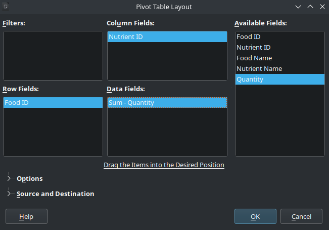
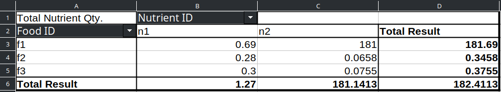

# Configured Deployment
In this section, you will see how to customize the actions, tables, and 
parameters of an app.

## Configuring `__init__.py`
All you need to do to customize an app is to populate some Python 
dictionaries in the `__init__.py` module. There are a few dictionaries that you 
can use:
* `actions_config`: for action configurations
* `parameters_config`: for parameters configurations
* `input_tables_config`: for input tables configurations
* `output_tables_config`: for output tables configurations
* `input_pivot_tables_config`: for input pivot tables definition
* `output_pivot_tables_config`: for output pivot tables definition

Next, we show how to define each of these dictionaries so
that Mip Hub can parse them.

### Actions config
If your package has actions, and you want them to be available in
your app, you need to provide four basic information about each 
action: 
* A display name
* Whether it's an input or output action
* The solving engine to be executed
* A tooltip

Here is an example of how to provide that information in the 
`__init__.py` module:
```python
from mip_me.action_update_food_cost import update_food_cost_solve
from mip_me.action_report_builder import report_builder_solve
actions_config = {
    'Update Food Cost': {
        'schema': 'input',
        'engine': update_food_cost_solve,
        'tooltip': "Update the food cost by the factor entered in the 'Food Cost Multiplier' parameter"},
    'Report Builder': {
        'schema': 'output',
        'engine': report_builder_solve,
        'tooltip': "Reads the output from the main engine and populate the report tables"}
    }
```
Few observations:
* The keys of the `actions_config` dictionary are the display 
names of the actions
* The value for `schema` can only be 'input' or 'output'.
* The tooltip can be an empty string.
* You must not change the keys of the actions dictionaries, 
  Mip Hub will look for those exact keywords.


### Parameters config
Just like tables, parameters can also be hidden, categorized, and ordered. 
In addition, parameters can have a tooltip, as actions have.

Here is the template dictionary for parameters:
```python
parameters_config = {
    'hidden': list(),
    'categories': dict(),
    'order': list(),
    'tooltips': dict()
    }
```

And here is how we can populate it for the `mip_me` package:
```python
parameters_config = {
    'hidden': list(),
    'categories': dict(),
    'order': ['Food Portions', 'Food Cost Multiplier'],
    'tooltips': {
        'Food Portions': "Whether fractional portions may compose the diet or only whole portions must be used",
        'Food Cost Multiplier': "The factor used by the Update Food Cost action to change food cost"
        }
    }
```

Few observations:
* We typically hide parameters that we don't want end-users
  to see or manipulate. We call these *advanced parameters*,
  because even though they are not visible in the Parameters
  window, consultants can still change their values via the
  `parameters` table (note that it's possible to upload
  a `parameters` table even if it's hidden!).
* The order in which parameters are listed within each category
  is the order in which they will be displayed in the app.
* The order in which parameters categories are defined in the
  `categories` dictionary is the order in which they will 
  be displayed in the app.
* Parameters that are not hidden and are not part of any category
  can also be ordered using the 'order' list.
* It's okay to have a mix of categorized and uncategorized 
  parameters. Parameters that are not assigned to any category are 
  placed on the upper part of the Parameters window, before any
  category.
* Display names of parameters are the exact names defined in
  the ticdat schema.

### Tables config
Here is the template dictionary that you can use to configure input tables.
```python
input_tables_config = {
    'hidden_tables': list(),
    'categories': dict(),
    'order': list(),
    'tables_display_names': dict(),
    'columns_display_names': dict(),
    'hidden_columns': dict()
    }
```
And here is how we can populate it for the `mip_me` package:
```python
input_tables_config = {
    'hidden_tables': ['parameters'],
    'categories': {
        'Master Tables': ['foods', 'nutrients'],
        'Composition Data': ['foods_nutrients']},
    'order': list(),
    'tables_display_names': {
        'foods_nutrients': 'Foods Composition'},
    'columns_display_names': {
        'foods': {'Per Unit Cost': 'Cost ($/unit)'},
        'nutrients': {'Min Intake': 'Minimum Intake',
                      'Max Intake': 'Maximum Intake'}},
    'hidden_columns': {
        'foods': ['Food ID'],
        'nutrients': ['Nutrient ID'],
        'foods_nutrients': ['Food ID', 'Nutrient ID']}
    }
```
Few observations:
* We typically hide the `parameters` table because it's easier
  and safer to change parameters values in the **Parameters**
  window.
* The order in which tables are listed within each category
  is the order in which they will be displayed in the app.
* The order in which tables categories are defined in the
  `categories` dictionary is the order in which they will 
  be displayed in the app.
* Tables that are not hidden and are not part of any category
  can also be ordered using the 'order' list.
* It's okay to have a mix of categorized and uncategorized 
  tables. Parameters that are not assigned to any category are 
  placed on the upper part of their group (Inputs or Outputs), 
  before any category.
* The default display name of a table is the Title Case of its
  backend name. For example, the table `foods_nutrients` would
  be displayed as *Foods Nutrients*, but in the example above
  we are overwriting it with *Foods Composition*.
* By default, columns are displayed as they are defined in
  the ticdat schema. But they can also be overwritten as 
  illustrated above.
* Not all tables have to be included in the `hidden_columns`
  dictionary, only those that have columns to be hidden.

Output tables are configured using the same template, just the name of the 
dictionary changes:
```python
output_tables_config = {
    'hidden_tables': list(),
    'categories': dict(),
    'order': list(),
    'tables_display_names': dict(),
    'columns_display_names': dict(),
    'hidden_columns': dict()
    }
```

### Pivot Tables config
These configurations allow us to pre-define one pivot table for each table in 
the schema (input and output). The user of the app can then download the 
table along with this pivot table as an `xls` or `xlsx` file from the table 
options menu. This functionality provides the user with a convenient way to 
analyze a summary of the data in each table. 

On LibreOffice (similarly on Excel), pivot tables can be built by 
dragging and dropping column names from the "Available Fields" into the 
appropriate boxes:  


To define a pivot table with code, we use the following template dictionary:
```python
input_pivot_tables_config = {
    'Pivot Table Display Name': {
        'table': 'table_name',
        'row_fields': list(),
        'column_fields': list(),
        'data_fields': 
            {'Result Column Name 1': 
                {'column': 'Field Name 1', 'operation':'sum'}, 
             'Result Column Name 2': 
                {'column': 'Field Name 2', 'operation':'count'}
             }
        }
    }
```
The value for 'operation' can be any of 'sum', 'count', 'average',  'max', 
'min, or 'count'.

And here is how we can populate it to get a pivot table for the 
`foods_nutrients` of the `mip_me` package:
```python
input_pivot_tables_config = {
    'Foods-Nutrients Summary': {
        'table': 'foods_nutrients',
        'row_fields': ['Food ID'],
        'column_fields': ['Nutrient ID'],
        'data_fields': 
          {'Total Nutrient Qty.': 
              {'column': 'Quantity', 'operation': 'sum'}
           }
        }
    }
```
This is how the pivot table would look like in this case:  


Output pivot tables are defined using the exact same template, just the name of 
the dictionary changes:
```python
output_pivot_tables_config = {
    'Pivot Table Display Name': {
        'table': 'table_name',
        'row_fields': list(),
        'column_fields': list(),
        'data_fields': 
            {'Result Column Name 1': 
                {'column': 'Field Name 1', 'operation':'sum'}, 
             'Result Column Name 2': 
                {'column': 'Field Name 2', 'operation':'count'}
             }
        }
    }
```

## Deploying the customized app
Here is what the `__init__.py` module of the customized version of the 
`mip_me` package looks like in the end:
```python
__version__ = "0.1.1"
from mip_me.schemas import input_schema, output_schema
from mip_me.action_update_food_cost import update_food_cost_solve
from mip_me.main import solve
from mip_me.action_report_builder import report_builder_solve

actions_config = {
    'Update Food Cost': {
        'schema': 'input',
        'engine': update_food_cost_solve,
        'tooltip': "Update the food cost by the factor entered in the 'Food Cost Multiplier' parameter"},
    'Report Builder': {
        'schema': 'output',
        'engine': report_builder_solve,
        'tooltip': "Reads the output from the main engine and populate the report tables"}
    }

input_tables_config = {
    'hidden_tables': ['parameters'],
    'categories': {
        'Master Tables': ['foods', 'nutrients'],
        'Composition Data': ['foods_nutrients']},
    'order': list(),
    'tables_display_names': {
        'foods_nutrients': 'Foods Composition'},
    'columns_display_names': {
        'foods': {'Per Unit Cost': 'Cost ($/unit)'},
        'nutrients': {'Min Intake': 'Minimum Intake',
                      'Max Intake': 'Maximum Intake'}},
    'hidden_columns': {
        'foods': ['Food ID'],
        'nutrients': ['Nutrient ID'],
        'foods_nutrients': ['Food ID', 'Nutrient ID']}
    }

output_tables_config = {
    'hidden_tables': list(),
    'categories': dict(),
    'order': ['buy', 'nutrition'],
    'tables_display_names': dict(),
    'columns_display_names': dict(),
    'hidden_columns': dict()
    }

parameters_config = {
    'hidden': list(),
    'categories': dict(),
    'order': ['Food Cost', 'Food Portions'],
    'tooltips': {
        'Food Portions': "Whether fractional portions may compose the diet or only whole portions must be used",
        'Food Cost Multiplier': "The factor used by the Update Food Cost action to change food cost"
        }
    }
```

Observe that we have bumped the version from `0.1.0` to `0.1.1`. To 
understand the logic behind version numbering, have a look at the [Version 
Numbering][version-numbering] section of the Python Packages book.

Once you are done updating the `__init__.py` module of your project, go 
ahead and execute `python3 -m build` from the terminal of your project again 
to generate the sdist of the new version of your package. Then upload it to 
Mip Hub and deploy a new app as done in the 
[Default Deployment][default_deployment] section.

🗒️ **Note:** 
*Every time you change something in `schemas.py`, renaming a table or adding 
a new parameter, for example, you might have to update some configuration in 
the `__init__.py` to reflect your changes.*

## Next steps
Now you can focus on enhancing your package. You will probably go through 
several cycles like this:
- Improve your code (add documentation, add features, 
  change schemas, fix bugs, etc.)
- Test your solution locally
- Create a new version of your package and deploy it
- Collect feedback and repeat

[version-numbering]: https://py-pkgs.org/07-releasing-versioning.html#version-numbering
[default_deployment]: ../3_default_deployment/README.md

### [Home][home] | [Back][back] | [Next][next] | [Help][help]

[home]: ../../README.md
[back]: ../3_default_deployment/README.md
[next]: ../5_virtual_environment/README.md
[help]: ../../0_help/README.md