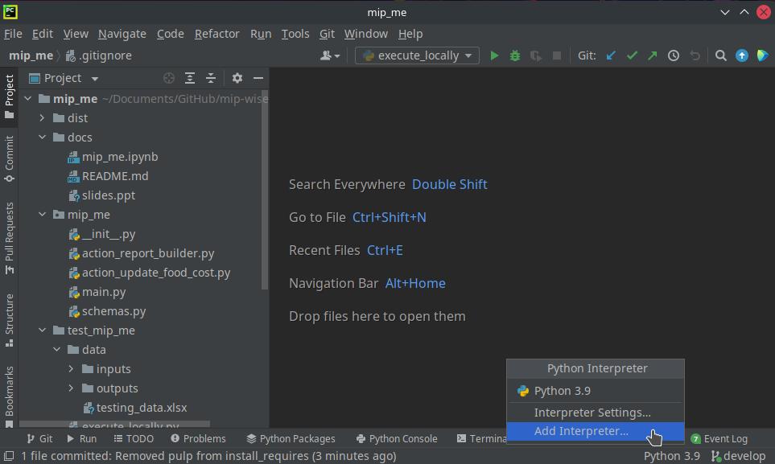
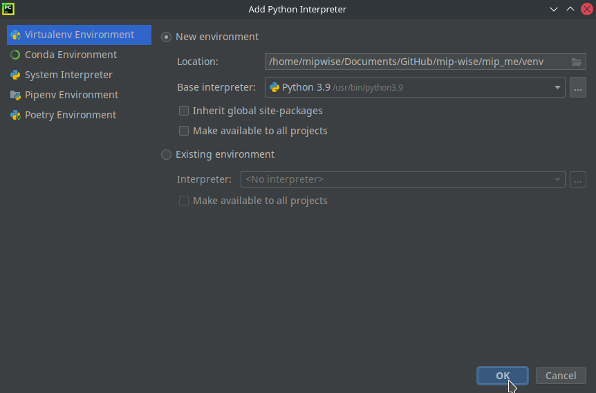
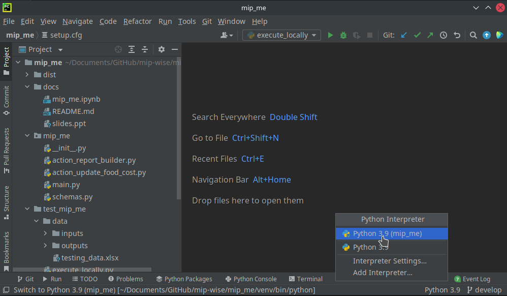
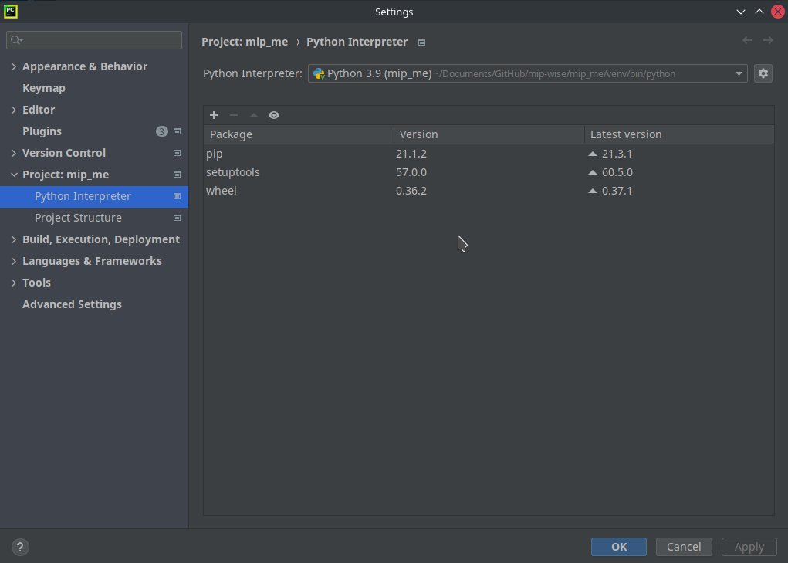
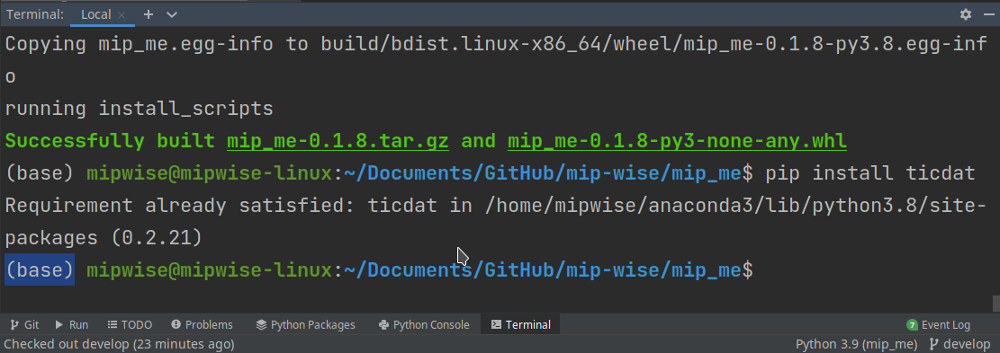

# Virtual Environment
Virtual environments allow us to configure the dependencies for a given 
project and keep these configurations isolated from other projects when 
testing locally.

For example, suppose you want to work with two versions of the same 
package--which could happen if you are debugging versions that you had 
previously released to clients, for instance. If you simply install it in 
your main Python interpreter, your previously installed version will be 
overwritten. 

In addition, two versions of the same package could have different 
dependencies. For example, one could require ticdat 0.2.21 while the other 
could require 0.2.19. It can become messy very easily.

Fortunately, Pycharm makes it very easy to create and use a new virtual 
environment.

## Creating a new virtual environment
Click in the current interpreter on your project (**Python 3.9** in the 
screenshot below), and then select **Add Interpreter**.


The configuration shown in the image below should work for you.



If you want to explore more, have a look at
[Configure a virtual environment][virtual_env_pycharm] on 
the Pycharm website.

Next time you click on the current interpreter on your project, you will see 
a list of options, and you can quickly switch between them.


And if you click on **Interpreter Settings...**, you will see all the 
packages already installed in that environment.



## Configuring the new environment
If you try to execute `execute_locally.py` now, you will get a 
`ModuleNotFoundError` because not even ticdat is installed in this 
environment yet.

You might want to go to the terminal and execute a `python3 -m pip install 
ticdat`. But it's very likely that your current terminal is pointing to your 
**base** interpreter as shown in the image below. 



If you click on the `+` button, it should open a new terminal that points to 
the current environment (indicated by the **venv** in front of **base**):
```ini
(venv) (base) mipwise@mipwise-linux:~/Documents/GitHub/mip-wise/mip_me$ 
```
Now, `python3 -m pip install ticdat` should work.

📝 **Tip:** 
*If you need a specific version of a package, let's say `ticdat 0.2.21`, you 
can do `python3 -m pip install ticdat==0.2.21`*

Alternatively, you can use the **Python Package** [tool window][tool_window]
of Pycharm. 

These are all useful tricks that you can keep in mind but in the next 
section, we will show a much more efficient option to install all the 
required packages.

## Installing packages from a `requirements.txt`
What if you need several packages of specific versions?
Installing one by one would be painful and prompt to making mistakes. A much 
more efficient way of doing this is using a `requirements.txt` file!

To test it out, create a text file at the root directory of your project and 
name it `requirements.txt`.

The content of this file is very similar to that of the `install_requires` 
argument of `setup.cfg` that we populated in the 
[Distribution Package][distribution_package] section. The main difference is 
that `install_requires` is defined for end-users and is meant to have the 
**minimal requirements** to use the package while `requirements.txt` is 
defined for developers and typically defines more **specific requirements**.

So, go ahead and add the following content to your `requirements.txt` file:
```ini
ticdat==0.2.21
pandas==1.3.5
gurobipy==9.5.0
```

Now, go to the terminal and execute the following command:
```commandline
python3 -m pip install -r requirements.txt
```
The three packages above should get installed.

This was a nice trick that you can keep in your toolbox. But if the 
dependencies of your package are listed in the `install_requires` of `setup.
cfg`, and assuming you are not very concerned about the exact versions of
the packages that will be installed, you can go straight to the installation 
of your own package.

## Installing your own package
To install your package from the files generated in the
[Distribution Package][distribution_package] section (those stored in the 
`dist` directory), just execute a `pip install` on one of those files:
```commandline
python3 -m pip install dist/mip_me-0.1.0.tar.gz
```
or
```commandline
python3 -m pip install dist/mip_me-0.1.0-py3-none-any.whl
```
Note that you need to add `dist/` in front of the file name if you are 
executing from the root directory (Pycharm default).

Any of the commands above will install all the required packages, including 
those listed in the `install_requires` argument of `setup.cfg`, along with 
your package.

------------------------------------------------------------------------------
Click **Next** when you be ready to continue.

[virtual_env_pycharm]: https://www.jetbrains.com/help/pycharm/creating-virtual-environment.html
[tool_window]: https://www.jetbrains.com/help/pycharm/installing-uninstalling-and-upgrading-packages.html
[distribution_package]: ../1_distribution_package/README.md

### [Home][home] | [Back][back] | [Next][next] | [Help][help]

[home]: ../../README.md
[back]: ../4_configured_deployment/README.md
[next]: ../next_steps/README.md
[help]: ../../0_help/README.md